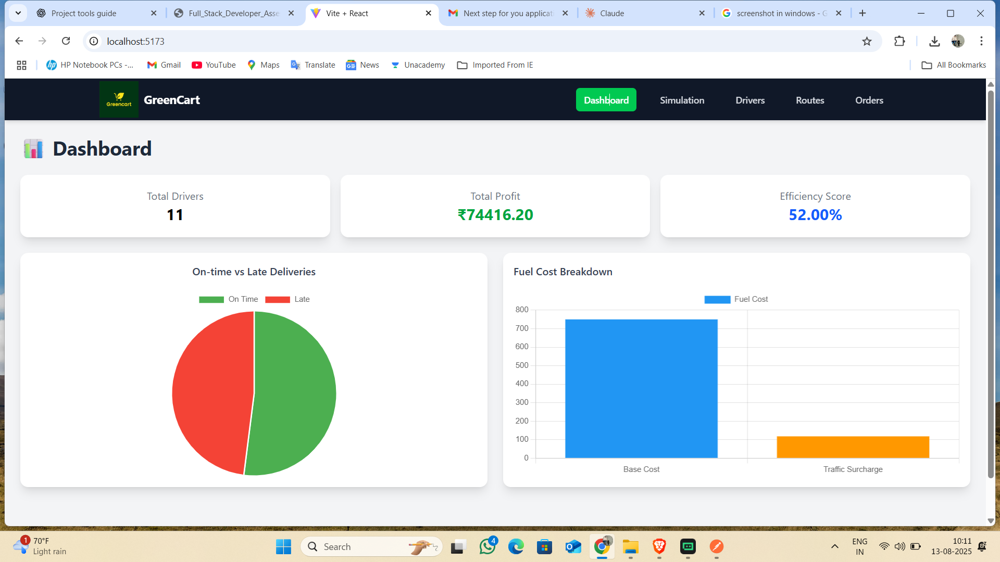
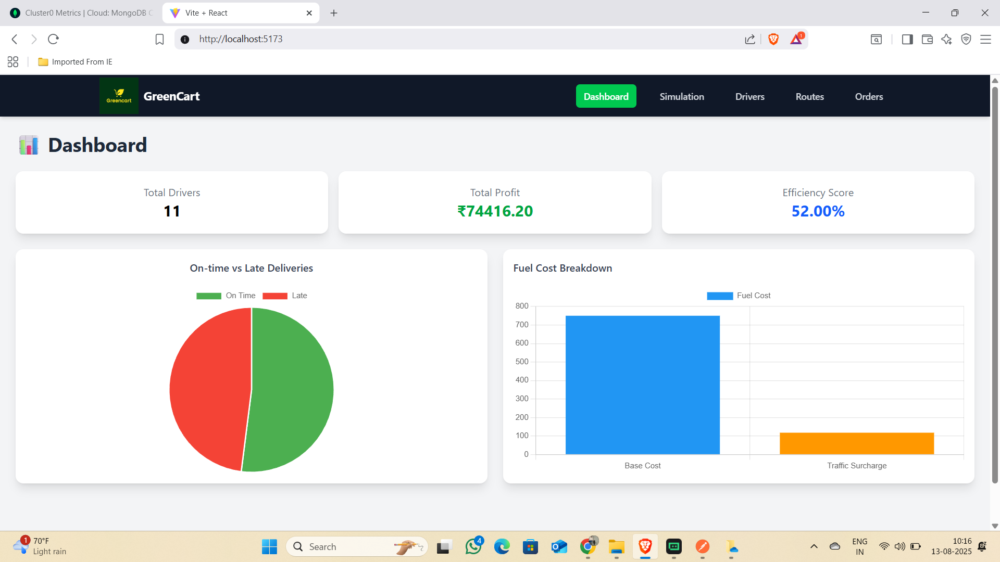
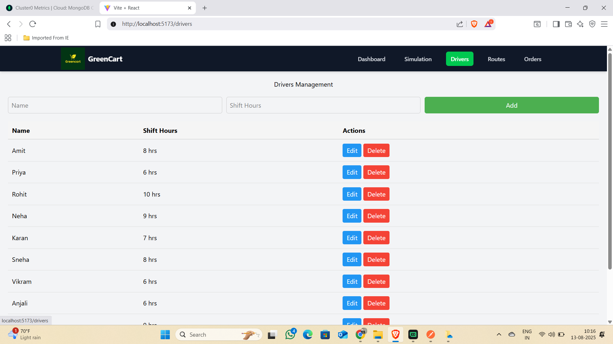
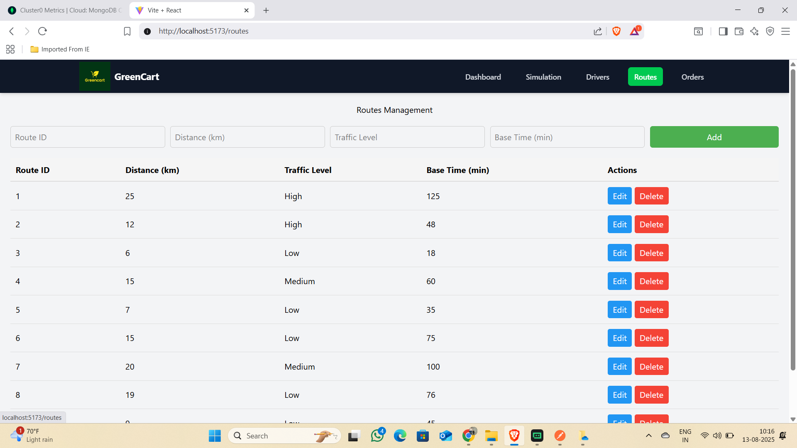
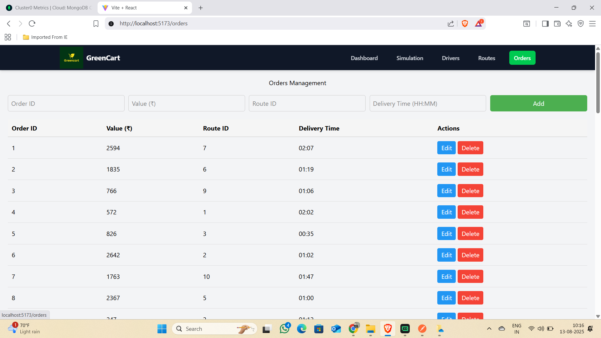

 # Purple Merits Logistics Optimization & Simulation Tool
 !screenshort of the app
 
 
 
 
 
    

## 📌 Project Overview & Purpose
This application is a **logistics management and simulation tool** designed for managers to:
- Manage **Drivers, Routes, and Orders** through an intuitive dashboard.
- Run **AI-based delivery simulations** considering driver fatigue, traffic conditions, penalties, and bonuses.
- Track **KPIs** such as total profit, efficiency score, fuel cost breakdown, and on-time vs. late deliveries.
- **Authenticate** securely so only authorized managers can access simulations and data.
- Save simulation results with timestamps and view a **history of past runs**.

This tool helps optimize delivery efficiency, reduce operational costs, and improve decision-making in logistics operations.

---

## 🛠 Tech Stack Used
### **Frontend**
- [React.js](https://react.dev/) with [Vite](https://vitejs.dev/) bundler
- [Tailwind CSS](https://tailwindcss.com/) for styling
- [React Router DOM](https://reactrouter.com/) for routing
- [Chart.js](https://www.chartjs.org/) for data visualization
- Axios for API requests

### **Backend**
- [Node.js](https://nodejs.org/) & [Express.js](https://expressjs.com/)
- [MongoDB](https://www.mongodb.com/) with [Mongoose](https://mongoosejs.com/)
- JWT Authentication
- bcrypt for password hashing
- CORS for secure API access

### **DevOps & Deployment**
- **Frontend:** Vercel (https://purple-greencart-lilac.vercel.app/)
- **Backend:** Render / Railway
- **Database:** MongoDB Atlas
- Environment variables via `.env` (excluded in `.gitignore`)
- Testing with Jest & Supertest

---

## ⚙ Setup Instructions (Local Development)

### 1️⃣ Clone Repository
```bash
git clone  https://github.com/mdsahilkhan2001/Purple-Greencart.git
cd Purple-Greencart
## 2️⃣ Install Dependencies
npm install
## 3️⃣ Run the Application
npm run dev 
## 4️⃣ Run the Backend
cd backend
npx nodemon server.js
```
